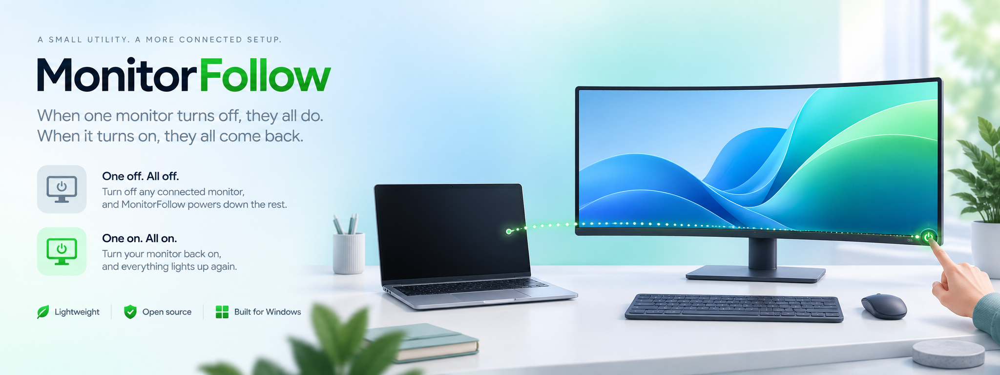
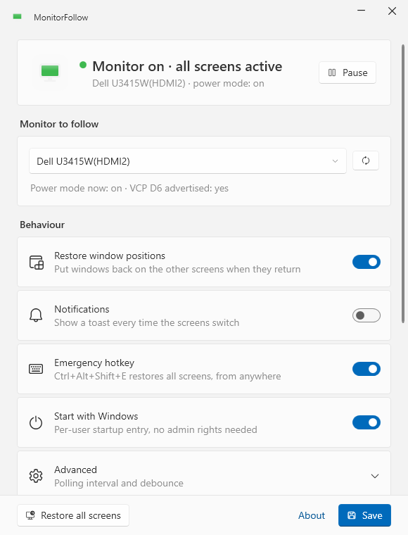

<p align="center"></p>

# MonitorFollow

**Your laptop screen follows the power button of your external monitor.**

Press the power button on your external monitor: the laptop panel (and any other screen) switches off.
Press it again: everything comes back, with your windows exactly where they were.

No cables, no smart plugs, no scripts to run. A small tray icon does it all.

## Why

When you work on a laptop docked to a big external monitor, "turning the desk off" is annoying:
Windows has no idea that you pressed the monitor's power button, so the laptop screen keeps glowing,
and when you come back you have to wake things up in the right order.

MonitorFollow watches the external monitor through **DDC/CI**, the same channel your OS uses to
change brightness. Most monitors keep answering DDC/CI queries even when switched off with the
power button, and they report *"I am off"*. That is the trigger.

## How it works

| Event | What MonitorFollow does |
|---|---|
| Monitor reports **off** (power button) | Saves the positions of the windows on the other screens, then switches Windows to **"Second screen only"** (like Win+P). The external monitor stays primary. |
| Monitor reports **on** again | Switches back to **"Extend"**, waits for the screens, restores the saved windows. |

Design choices that keep you safe:

- **Read-only DDC/CI.** It only *reads* VCP code `0xD6` (power mode). It never writes to the monitor, so it cannot leave it in a state it can't recover from.
- **No DPMS standby.** The other screens are removed from the desktop layout, not put to sleep. Polling DDC on a DPMS-sleeping output makes many GPU drivers flicker the panel; topology changes don't.
- **Two ways out, always.** `Ctrl+Alt+Shift+E` restores all screens (configurable), and Windows' own `Win+P → Extend` works regardless of this app.
- **Nothing moves on the external monitor.** Windows keeps seeing the monitor as connected, so windows on it never jump around.

## Requirements

- Windows 10 (1903+) or Windows 11.
- An external monitor connected **directly to the GPU** (HDMI, DisplayPort, USB‑C DP Alt Mode). DisplayLink adapters do not pass DDC/CI.
- **DDC/CI enabled** in the monitor's OSD menu (it usually is).
- [.NET 8 Desktop Runtime](https://dotnet.microsoft.com/download/dotnet/8.0) for the small build, or use the self-contained build.

Tested with a Dell U3415W over HDMI on Windows 11. Reports for other monitors are very welcome: open an issue with your model and what the *Settings* window shows in "Power mode now" when the monitor is off.

## Install

1. Download `MonitorFollow.exe` from the [Releases](../../releases) page.
2. Run it. A monitor icon appears in the notification area (bottom right, maybe behind the `^` arrow).
3. The Settings window opens on first run: pick your external monitor, tick **Start with Windows**, Save.
4. Press the power button on the monitor. Done.

<p align="center"></p>

Tray icon colours: green = monitor on, grey = monitor off (second screen only), red = monitor not found, yellow = paused.
Left-click the icon to open the window, right-click for the quick menu. Closing the window keeps MonitorFollow running in the tray; use *Exit* in the menu to quit.

The UI is native WPF with the Fluent design of Windows 11 (Mica, light/dark follows the system). Start with `MonitorFollow.exe --show` to open the window immediately.

## Settings

| Setting | Default | Meaning |
|---|---|---|
| Monitor to follow | — | Only monitors that answer DDC/CI power queries are listed. |
| Poll interval | 1000 ms | How often the monitor is asked for its power state. |
| Consecutive "off" readings | 2 | Debounce, so a single glitchy reading doesn't switch your screens. |
| Restore window positions | on | Put windows back on the other screens when they return. |
| Emergency hotkey | on | `Ctrl+Alt+Shift+E` = restore all screens now. |
| Start with Windows | off | Adds a per-user Run entry pointing at the current exe, no admin needed. Move the exe first, then enable it. |

Settings and log live in `%APPDATA%\MonitorFollow\`.

## Build from source

```powershell
git clone https://github.com/f-liva/MonitorFollow
cd MonitorFollow
dotnet publish src/MonitorFollow -c Release -r win-x64 --self-contained false -o out
```

Add `--self-contained true` for a single exe that does not need the .NET runtime (~70 MB).

## Troubleshooting

- **My monitor is not listed.** Enable DDC/CI in the OSD. Make sure the cable goes to the GPU and not through a DisplayLink dock. Some KVMs block DDC/CI.
- **The monitor is listed but nothing happens when I switch it off.** Some monitors stop answering DDC/CI when off instead of reporting "off". Open Settings, switch the monitor off and back on, and check the live log: if you see `no reply` streaks instead of `off (power button)`, open an issue, it can be supported with a "no reply = off" option.
- **Windows didn't come back to the right screen.** Windows 11 also has *Settings → System → Display → Multiple displays → Remember window locations based on monitor connection*. Turn it on; MonitorFollow's own restore then acts as a fast path.
- **I'm stuck with a black laptop screen.** Press `Ctrl+Alt+Shift+E`, or `Win+P` then `↑` then `Enter` (selects Extend blind), or simply turn the external monitor on.

## Contributing

Issues and pull requests are welcome. Please include your monitor model, connection type and the relevant lines from the log.

## License

MIT. See [LICENSE](LICENSE).
